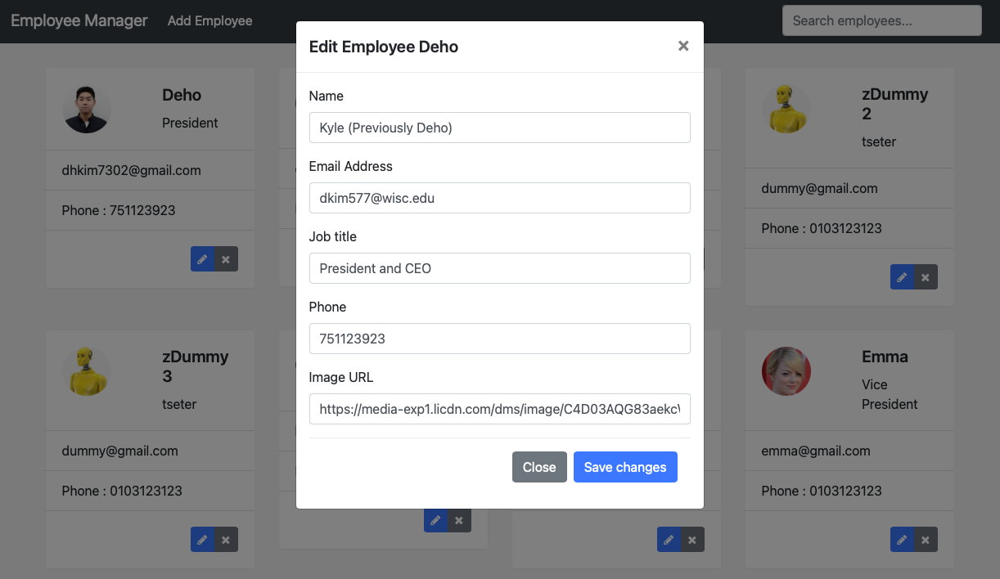

# Employees Manamgement App

## I. Description
This web application allows you managing brief overview of your organization, or temperary team member in a single page.

## II. How to Run

### Back-End
- Clone backend repo [https://github.com/KyleKim107/Employee_Manage_Program]
-  Runs Main method of EmployeeManagerApplication Class

### Front-End
- Clone front repo [https://github.com/KyleKim107/Employee-Manage-FE]
- Type "ng serve" in cmd to run front page.

## III. Functionality
There are a couple of functions you can try in this app.
1. Add New Employee by Clicking "Add Employee" on the Nav Bar
2. Modify Exist Employee's Personal Info by clicking "Pencel" Button in each Card View
3. Remove Team Member by clicking "X" button in each Card
4. Search Specific Members by name, jobtitle, email, and phone number.

I. Overview

II. Add New Employee

II. Modify Exist Employee

II. Delete Exist Employee

- Delete Control Module

- Dashboard After Delete

III. Search Employee

- Search My Name

- Search by Email Domain EX) @gmail.com
